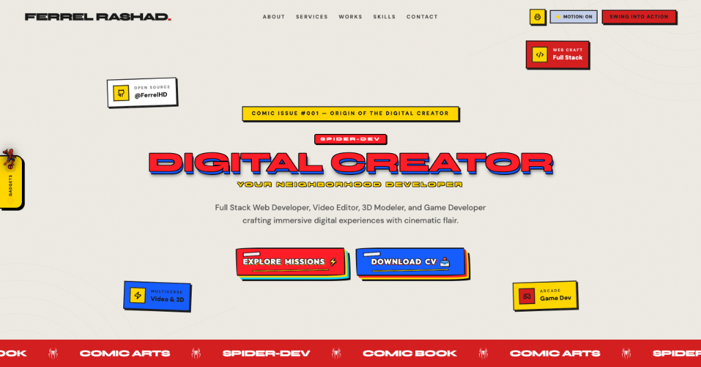

# 🕷️ Ferrel Rashad Akeyla — The Amazing Spider-Dev Portfolio

<div align="center">


### 🌐 [Live Production Demo](https://ferrelhd.github.io/Portofolio/)

*An immersive, high-performance developer portfolio built with vintage Marvel comic aesthetics, 60 FPS GSAP horizontal parallax scroll, interactive canvas arcade mini-games, reactive Spider-Suit HUD, and a live web synthesizer audio suite.*

<br />

[](https://ferrelhd.github.io/Portofolio/)

</div>

---

## 📖 Overview

This portfolio is an interactive digital experience crafted to showcase the engineering capabilities of **Ferrel Rashad Akeyla** (Full-Stack Web Developer, Game Designer, and Visual Creator). 

Inspired by classic Spider-Man comic books, the UI blends retro halftone Ben-Day dots, hard comic pop-shadows, bold typography, authentic newsprint cream palettes (`#EDEAE2`), and dynamic spring physics with modern web performance standards.

---

## ✨ Key Interactive Features

### 🕸️ 1. Dual-Ring Orbital Spider-Web Matrix (`SpiderSkillWeb.jsx`)
- **Continuous 60 FPS Orbital Rotation**: Powered by native `requestAnimationFrame` and polar coordinate trigonometry.
- **Inner Orbit (Core Stack)**: React 19, Tailwind CSS, TypeScript, Node.js, Video Editing, Framer Motion rotating clockwise.
- **Outer Orbit (Secondary & Exploring)**: Blender 3D, Unity C#, Figma, SQL Databases, AI Agents rotating counter-clockwise.
- **Smart Auto-Pause**: Automatically freezes orbital motion upon hover or touch so recruiters can comfortably inspect nodes and read technical breakdowns.
- **Classified Deck Mode**: Alternative view featuring collectible comic trading cards with arcade power mastery level meters.

### 📡 2. Mission Archives Radar Tracker & Parallax Reveal (`Projects.jsx`)
- **GSAP Horizontal Parallax Reveal**: Starts with a bold red entrance and glides mission cards smoothly along the X-axis upon scrolling.
- **Responsive Mobile Touch Swipe**: Native `snap-x snap-mandatory` horizontal touch track with live radar progress tracking for smartphones.
- **Featured Missions Dossier**:
  - **ISSUE #00**: *Spider-Dev Portfolio* — Interactive superhero portfolio with GSAP & Web Audio API.
  - **ISSUE #08**: *Fersya Shop* — Laravel 11 & Filament health/organic e-commerce store.
  - **ISSUE #01**: *Finesser Shop* — Digital asset template storefront.
  - **ISSUE #07**: *Student Life* — React 19 & TypeScript academic tracker with Supabase.
  - **ISSUE #02**: *Street Rush* — Fast-paced 3D arcade mobile runner in Unity & C#.
  - **ISSUE #04**: *Gunung Gede Via Gunung Putri* — 3D hiking simulation on Roblox Studio in Luau.
  - **ISSUE #03 & #06**: *Frank Ocean & Carti AMV* — High-tempo cinematic anime music videos in Vegas Pro.
- **Spidey Tracker Audio SFX**: Audio feedback trigger on card clicks, category filters, and mission briefs.

### 🎛️ 3. Spider-Suit HUD & Diagnostics Widget (`About.jsx`)
- **Interactive Web-Shooter**: Clickable web cartridge with `THWIP!` SFX, ammo depletion, haptics, and auto-reload.
- **Diagnostics Radar**: Live metrics tracking Spider-Sense latency, suit integrity, and combat readiness.
- **Clean Marvel Caption Card**: Structured narrative bio with Uncle Ben's core motto and discipline chips.

### 🕹️ 4. Spidey Bug Hunter Mini-Game (`SpideyBugHunter.jsx`)
- Built-in 30-second HTML5 Canvas 2D arcade shooter.
- Shoot webs (`THWIP!`) at flying runtime exceptions (`NullPointer`, `SyntaxError`, `404 Not Found`, `Infinite Loop`, `MemoryLeak`).
- Features combo multipliers, web particle physics, local storage high scores, and audio synthesizer sound effects.

### 📰 5. The Daily Bugle Press (`DailyBugleModal.jsx`)
- Fullscreen retro investigative newspaper modal.
- Includes authentic halftone print effects, vintage classified ads, developer origin stories, and interactive comic articles.

### 📄 6. Interactive Pitch Deck & PDF Export (`PortfolioDeckModal.jsx`)
- Built-in presentation deck modeled after confidential superhero dossier files.
- Real-time slide navigation (<kbd>E</kbd> hotkey) with high-contrast comic styling.
- Direct high-resolution landscape PDF export generator.

### 🦸‍♂️ 7. Spider Control Dock / Gadget Drawer (`SpiderGadgetDrawer.jsx`)
- Floating comic dock on the left viewport margin with an animated pixel **Spider-Man perched on top**.
- **Multiverse Suit Switcher**: Dynamically changes site-wide CSS root variables:
  - 🔴 **Classic Red & Blue** (Peter Parker)
  - ⚫ **Brooklyn Cyber** (Miles Morales)
  - 🌸 **Ghost-Spider** (Gwen Stacy)
  - 🔷 **2099 Cyber Glow** (Miguel O'Hara)
- **Multiverse Achievement Badges**: Tracks 7 easter-egg milestones (Spider-Sense, Terminal Hacker, Suit Collector, Bug Squasher, etc.) with local storage persistence.
- **Audio Suite**: Web Audio API synthesizer for retro 8-bit sound effects (SFX) + background ambient music player with real-time volume slider and mute controls.

### ⌨️ 8. Web Terminal Command Palette (`CommandPalette.jsx`)
- Quick-access terminal drawer accessible via <kbd>Ctrl</kbd> + <kbd>K</kbd> or <kbd>Cmd</kbd> + <kbd>K</kbd>.
- Navigate sections, switch multiverse themes, trigger Spider-Sense, or download CV instantly from your keyboard.

### 🪟 9. React Portal Architecture (`ProjectBriefModal.jsx` & `VideoModal.jsx`)
- Modals mount directly to `document.body` via `createPortal` to prevent parent GSAP transform coordinate clipping.
- Guaranteed 100% viewport centering with sticky headers, sticky actions, and smooth internal scrolling on all screen sizes and zoom levels.

---

## ⚡ Performance & Optimization Architecture

This application is engineered for maximum performance, minimal bundle weight, and smooth 60 FPS execution across desktop and mobile devices:

- 🚀 **Dynamic Code-Splitting & Lazy Loading (`React.lazy`)**: Interactive overlays, modals, and heavy canvas components (`SpideyBugHunter`, `DailyBugleModal`, `CommandPalette`, `SpiderGadgetDrawer`, `PortfolioDeckModal`) are loaded dynamically, reducing initial JavaScript bundle size for rapid FCP & LCP.
- 📱 **Adaptive 60 FPS Mobile Touch Scroll**: Native `snap-x` momentum swipe on smartphones with lightweight scroll progress listeners.
- 🔊 **Zero-Bloat Web Audio API Synthesizer**: Procedural Web Audio oscillators generate retro 8-bit sound effects directly in code without requiring external audio asset network downloads.
- 🎨 **CSS Hardware Acceleration & DOM Scaffolding**: Utilizes `content-visibility: auto` on offscreen sections and GPU composite layers (`transform: translateZ(0)`) to eliminate frame drops during rapid scrolling.

---

## 🛠️ Tech Stack & Dependencies

| Category | Technologies / Libraries |
|---|---|
| **Core Framework** | React 19, JavaScript (ESNext) |
| **Styling & Design System** | Tailwind CSS v4, Custom CSS Utilities, Comic Pop Art Tokens |
| **Motion & Animation** | GSAP 3 (ScrollTrigger, matchMedia), Framer Motion (Spring Physics) |
| **Audio Engine** | Native Web Audio API (Synthesizer SFX) + HTML5 Audio Element |
| **Portals & Modals** | React DOM `createPortal`, AnimatePresence |
| **Icons & Assets** | Lucide React, Official Brand SVG/PNG Assets, Pixel Art GIFs |
| **Build & Tooling** | Vite, PostCSS, ESLint, Git |
| **Deployment** | GitHub Pages (GitHub Actions CI/CD pipeline) |

---

## 📁 Project Architecture

```plaintext
Portofolio/
├── public/
│   ├── preview-v2.png         # High-res web preview for README & embeds
│   ├── preview.png            # Web preview fallback
│   ├── spidey.gif             # Animated browser tab favicon
│   ├── cv.pdf                 # Curated downloadable CV
│   └── Ferrel_Rashad_Portfolio_Deck.pdf # Exportable landscape portfolio deck
├── src/
│   ├── assets/                # Real brand icons, sprites, audio tracks
│   ├── components/
│   │   ├── About.jsx          # Origin story, power stats & Spider-Suit HUD
│   │   ├── BackToTop.jsx      # Spider-web vertical launcher button
│   │   ├── ComicTicker.jsx    # Infinite Daily Bugle marquee banner
│   │   ├── CommandPalette.jsx # Keyboard shortcut terminal modal (Ctrl+K)
│   │   ├── Contact.jsx        # Comic transmission contact form & socials
│   │   ├── DailyBugleModal.jsx# Retro newspaper investigative modal
│   │   ├── Footer.jsx         # Multiverse edition footer & spider emblem
│   │   ├── Hero.jsx           # Superhero landing showcase
│   │   ├── Navbar.jsx         # Top comic navigation & motion toggles
│   │   ├── PortfolioDeckModal.jsx # Fullscreen pitch deck & PDF export
│   │   ├── ProjectBriefModal.jsx # React Portal classified mission modal
│   │   ├── Projects.jsx       # GSAP horizontal parallax archives & mobile swipe
│   │   ├── ScrollFX.jsx       # Spider-laser scroll progress tracker
│   │   ├── Services.jsx       # What I do / Superhero mission offerings
│   │   ├── Skills.jsx         # Ability Matrix container & Classified Deck
│   │   ├── SpiderGadgetDrawer.jsx # Multiverse theme dock & audio suite
│   │   ├── SpiderSkillWeb.jsx # Dual-ring 60 FPS orbital web matrix
│   │   ├── SpideyBugHunter.jsx# HTML5 Canvas 30s arcade mini-game
│   │   ├── StickyComicTicker.jsx # Sticky bottom comic ribbon with color inversion
│   │   └── VideoModal.jsx     # React Portal video player popup
│   ├── lib/
│   │   ├── achievements.js    # LocalStorage gamified achievement tracker
│   │   ├── animation.js       # Framer Motion spring presets & stagger variants
│   │   └── soundFx.js         # Native Web Audio API procedural sound fx
│   ├── App.jsx                # Main application assembler & state hub
│   ├── index.css              # Comic design system, keyframes & theme tokens
│   └── main.jsx               # React DOM entrypoint
├── package.json
├── vite.config.js
└── README.md
```

---

## 🚀 Getting Started Locally

To run this project on your local machine:

### 1. Clone the repository
```bash
git clone https://github.com/FerrelHD/Portofolio.git
cd Portofolio
```

### 2. Install dependencies
```bash
npm install
```

### 3. Start development server
```bash
npm run dev
```
Open [http://localhost:5173/Portofolio/](http://localhost:5173/Portofolio/) in your browser.

### 4. Build for production
```bash
npm run build
```

### 5. Preview production build
```bash
npm run preview
```

---

## 🎮 Keyboard Shortcuts

- <kbd>Ctrl</kbd> + <kbd>K</kbd> / <kbd>Cmd</kbd> + <kbd>K</kbd> — Open Spider Terminal Command Palette
- <kbd>E</kbd> — Open Portfolio Pitch Deck & PDF Export Modal
- <kbd>S</kbd> — Trigger Spider-Sense Tingling Radar Glow
- <kbd>G</kbd> — Launch Spidey Bug Hunter 30s Arcade Mini-Game
- <kbd>N</kbd> / <kbd>B</kbd> — Read The Daily Bugle Newspaper Press Report
- <kbd>D</kbd> — Toggle Spider Gadget Dock & Multiverse Theme Suits
- <kbd>P</kbd> — Play / Pause Background Music Track
- <kbd>M</kbd> — Mute / Unmute Audio Suite
- <kbd>1</kbd> - <kbd>6</kbd> — Instant Jump to Sections (Hero, About, Services, Projects, Skills, Contact)
- <kbd>?</kbd> — Toggle Comic Shortcuts Cheatsheet Modal
- <kbd>Esc</kbd> — Close all active modals & slide-out drawers

---

## 👤 Author

**Ferrel Rashad Akeyla**
- 💼 **Portfolio**: [ferrelhd.github.io/Portofolio](https://ferrelhd.github.io/Portofolio/)
- 🐙 **GitHub**: [@FerrelHD](https://github.com/FerrelHD)
- 👔 **LinkedIn**: [Ferrel Rashad](https://www.linkedin.com/in/ferrel-rashad-8a165514b/)
- ✉️ **Email**: [ferrelrashadakeyla2014@gmail.com](mailto:ferrelrashadakeyla2014@gmail.com)

---

<div align="center">

*"With great code comes great responsibility."* 🕷️⚡

</div>
